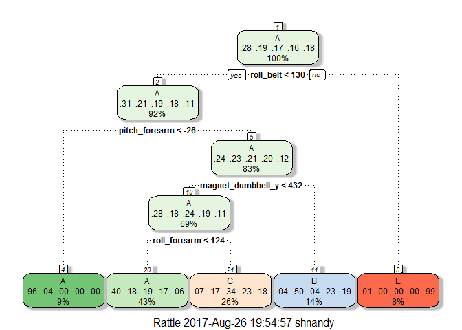

Overview
--------

This analysis utilizes self movement data from accelerometers on the
belt, forearm, arm, and dumbell of 6 participants to predict
quantitively how well a particular exercise was performed. Participents
were asked to perform barbell lifts correctly and incorrectly in 5
different ways:

-   Class A: exactly according to the specification
-   Class B: throwing the elbows to the front
-   Class C: lifting the dumbbell only halfway
-   Class D: lowering the dumbbell only half way
-   Class E: throwing the hips to the front.

Only class A corresponds to the specified execution of the exercise, and
others correspond to common mistakes.

More information is available from the website here:
<http://groupware.les.inf.puc-rio.br/har> (see the section on the Weight
Lifting Exercise Dataset).

Data
----

    ## download data
    if(!file.exists("./data")){dir.create("./data")}
    fileURL <- "https://d396qusza40orc.cloudfront.net/predmachlearn/pml-training.csv"
    #download.file(fileURL,destfile="./data/pml-training.csv")
    fileURLT <- "https://d396qusza40orc.cloudfront.net/predmachlearn/pml-testing.csv"
    #download.file(fileURLT,destfile="./data/pml-testing.csv")

    # read file
    train <- read.csv("./data/pml-training.csv")
    test <- read.csv("./data/pml-testing.csv")
    dim(train)

    ## [1] 19622   160

    dim(test)

    ## [1]  20 160

    str(train)

    ## 'data.frame':    19622 obs. of  160 variables:
    ##  $ X                       : int  1 2 3 4 5 6 7 8 9 10 ...
    ##  $ user_name               : Factor w/ 6 levels "adelmo","carlitos",..: 2 2 2 2 2 2 2 2 2 2 ...
    ##  $ raw_timestamp_part_1    : int  1323084231 1323084231 1323084231 1323084232 1323084232 1323084232 1323084232 1323084232 1323084232 1323084232 ...
    ##  $ raw_timestamp_part_2    : int  788290 808298 820366 120339 196328 304277 368296 440390 484323 484434 ...
    ##  $ cvtd_timestamp          : Factor w/ 20 levels "02/12/2011 13:32",..: 9 9 9 9 9 9 9 9 9 9 ...
    ##  $ new_window              : Factor w/ 2 levels "no","yes": 1 1 1 1 1 1 1 1 1 1 ...
    ##  $ num_window              : int  11 11 11 12 12 12 12 12 12 12 ...
    ##  $ roll_belt               : num  1.41 1.41 1.42 1.48 1.48 1.45 1.42 1.42 1.43 1.45 ...
    ##  $ pitch_belt              : num  8.07 8.07 8.07 8.05 8.07 8.06 8.09 8.13 8.16 8.17 ...
    ##  $ yaw_belt                : num  -94.4 -94.4 -94.4 -94.4 -94.4 -94.4 -94.4 -94.4 -94.4 -94.4 ...
    ##  $ total_accel_belt        : int  3 3 3 3 3 3 3 3 3 3 ...
    ##  $ kurtosis_roll_belt      : Factor w/ 397 levels "","-0.016850",..: 1 1 1 1 1 1 1 1 1 1 ...
    ##  $ kurtosis_picth_belt     : Factor w/ 317 levels "","-0.021887",..: 1 1 1 1 1 1 1 1 1 1 ...
    ##  $ kurtosis_yaw_belt       : Factor w/ 2 levels "","#DIV/0!": 1 1 1 1 1 1 1 1 1 1 ...
    ##  $ skewness_roll_belt      : Factor w/ 395 levels "","-0.003095",..: 1 1 1 1 1 1 1 1 1 1 ...
    ##  $ skewness_roll_belt.1    : Factor w/ 338 levels "","-0.005928",..: 1 1 1 1 1 1 1 1 1 1 ...
    ##  $ skewness_yaw_belt       : Factor w/ 2 levels "","#DIV/0!": 1 1 1 1 1 1 1 1 1 1 ...
    ##  $ max_roll_belt           : num  NA NA NA NA NA NA NA NA NA NA ...
    ##  $ max_picth_belt          : int  NA NA NA NA NA NA NA NA NA NA ...
    ##  $ max_yaw_belt            : Factor w/ 68 levels "","-0.1","-0.2",..: 1 1 1 1 1 1 1 1 1 1 ...
    ##  $ min_roll_belt           : num  NA NA NA NA NA NA NA NA NA NA ...
    ##  $ min_pitch_belt          : int  NA NA NA NA NA NA NA NA NA NA ...
    ##  $ min_yaw_belt            : Factor w/ 68 levels "","-0.1","-0.2",..: 1 1 1 1 1 1 1 1 1 1 ...
    ##  $ amplitude_roll_belt     : num  NA NA NA NA NA NA NA NA NA NA ...
    ##  $ amplitude_pitch_belt    : int  NA NA NA NA NA NA NA NA NA NA ...
    ##  $ amplitude_yaw_belt      : Factor w/ 4 levels "","#DIV/0!","0.00",..: 1 1 1 1 1 1 1 1 1 1 ...
    ##  $ var_total_accel_belt    : num  NA NA NA NA NA NA NA NA NA NA ...
    ##  $ avg_roll_belt           : num  NA NA NA NA NA NA NA NA NA NA ...
    ##  $ stddev_roll_belt        : num  NA NA NA NA NA NA NA NA NA NA ...
    ##  $ var_roll_belt           : num  NA NA NA NA NA NA NA NA NA NA ...
    ##  $ avg_pitch_belt          : num  NA NA NA NA NA NA NA NA NA NA ...
    ##  $ stddev_pitch_belt       : num  NA NA NA NA NA NA NA NA NA NA ...
    ##  $ var_pitch_belt          : num  NA NA NA NA NA NA NA NA NA NA ...
    ##  $ avg_yaw_belt            : num  NA NA NA NA NA NA NA NA NA NA ...
    ##  $ stddev_yaw_belt         : num  NA NA NA NA NA NA NA NA NA NA ...
    ##  $ var_yaw_belt            : num  NA NA NA NA NA NA NA NA NA NA ...
    ##  $ gyros_belt_x            : num  0 0.02 0 0.02 0.02 0.02 0.02 0.02 0.02 0.03 ...
    ##  $ gyros_belt_y            : num  0 0 0 0 0.02 0 0 0 0 0 ...
    ##  $ gyros_belt_z            : num  -0.02 -0.02 -0.02 -0.03 -0.02 -0.02 -0.02 -0.02 -0.02 0 ...
    ##  $ accel_belt_x            : int  -21 -22 -20 -22 -21 -21 -22 -22 -20 -21 ...
    ##  $ accel_belt_y            : int  4 4 5 3 2 4 3 4 2 4 ...
    ##  $ accel_belt_z            : int  22 22 23 21 24 21 21 21 24 22 ...
    ##  $ magnet_belt_x           : int  -3 -7 -2 -6 -6 0 -4 -2 1 -3 ...
    ##  $ magnet_belt_y           : int  599 608 600 604 600 603 599 603 602 609 ...
    ##  $ magnet_belt_z           : int  -313 -311 -305 -310 -302 -312 -311 -313 -312 -308 ...
    ##  $ roll_arm                : num  -128 -128 -128 -128 -128 -128 -128 -128 -128 -128 ...
    ##  $ pitch_arm               : num  22.5 22.5 22.5 22.1 22.1 22 21.9 21.8 21.7 21.6 ...
    ##  $ yaw_arm                 : num  -161 -161 -161 -161 -161 -161 -161 -161 -161 -161 ...
    ##  $ total_accel_arm         : int  34 34 34 34 34 34 34 34 34 34 ...
    ##  $ var_accel_arm           : num  NA NA NA NA NA NA NA NA NA NA ...
    ##  $ avg_roll_arm            : num  NA NA NA NA NA NA NA NA NA NA ...
    ##  $ stddev_roll_arm         : num  NA NA NA NA NA NA NA NA NA NA ...
    ##  $ var_roll_arm            : num  NA NA NA NA NA NA NA NA NA NA ...
    ##  $ avg_pitch_arm           : num  NA NA NA NA NA NA NA NA NA NA ...
    ##  $ stddev_pitch_arm        : num  NA NA NA NA NA NA NA NA NA NA ...
    ##  $ var_pitch_arm           : num  NA NA NA NA NA NA NA NA NA NA ...
    ##  $ avg_yaw_arm             : num  NA NA NA NA NA NA NA NA NA NA ...
    ##  $ stddev_yaw_arm          : num  NA NA NA NA NA NA NA NA NA NA ...
    ##  $ var_yaw_arm             : num  NA NA NA NA NA NA NA NA NA NA ...
    ##  $ gyros_arm_x             : num  0 0.02 0.02 0.02 0 0.02 0 0.02 0.02 0.02 ...
    ##  $ gyros_arm_y             : num  0 -0.02 -0.02 -0.03 -0.03 -0.03 -0.03 -0.02 -0.03 -0.03 ...
    ##  $ gyros_arm_z             : num  -0.02 -0.02 -0.02 0.02 0 0 0 0 -0.02 -0.02 ...
    ##  $ accel_arm_x             : int  -288 -290 -289 -289 -289 -289 -289 -289 -288 -288 ...
    ##  $ accel_arm_y             : int  109 110 110 111 111 111 111 111 109 110 ...
    ##  $ accel_arm_z             : int  -123 -125 -126 -123 -123 -122 -125 -124 -122 -124 ...
    ##  $ magnet_arm_x            : int  -368 -369 -368 -372 -374 -369 -373 -372 -369 -376 ...
    ##  $ magnet_arm_y            : int  337 337 344 344 337 342 336 338 341 334 ...
    ##  $ magnet_arm_z            : int  516 513 513 512 506 513 509 510 518 516 ...
    ##  $ kurtosis_roll_arm       : Factor w/ 330 levels "","-0.02438",..: 1 1 1 1 1 1 1 1 1 1 ...
    ##  $ kurtosis_picth_arm      : Factor w/ 328 levels "","-0.00484",..: 1 1 1 1 1 1 1 1 1 1 ...
    ##  $ kurtosis_yaw_arm        : Factor w/ 395 levels "","-0.01548",..: 1 1 1 1 1 1 1 1 1 1 ...
    ##  $ skewness_roll_arm       : Factor w/ 331 levels "","-0.00051",..: 1 1 1 1 1 1 1 1 1 1 ...
    ##  $ skewness_pitch_arm      : Factor w/ 328 levels "","-0.00184",..: 1 1 1 1 1 1 1 1 1 1 ...
    ##  $ skewness_yaw_arm        : Factor w/ 395 levels "","-0.00311",..: 1 1 1 1 1 1 1 1 1 1 ...
    ##  $ max_roll_arm            : num  NA NA NA NA NA NA NA NA NA NA ...
    ##  $ max_picth_arm           : num  NA NA NA NA NA NA NA NA NA NA ...
    ##  $ max_yaw_arm             : int  NA NA NA NA NA NA NA NA NA NA ...
    ##  $ min_roll_arm            : num  NA NA NA NA NA NA NA NA NA NA ...
    ##  $ min_pitch_arm           : num  NA NA NA NA NA NA NA NA NA NA ...
    ##  $ min_yaw_arm             : int  NA NA NA NA NA NA NA NA NA NA ...
    ##  $ amplitude_roll_arm      : num  NA NA NA NA NA NA NA NA NA NA ...
    ##  $ amplitude_pitch_arm     : num  NA NA NA NA NA NA NA NA NA NA ...
    ##  $ amplitude_yaw_arm       : int  NA NA NA NA NA NA NA NA NA NA ...
    ##  $ roll_dumbbell           : num  13.1 13.1 12.9 13.4 13.4 ...
    ##  $ pitch_dumbbell          : num  -70.5 -70.6 -70.3 -70.4 -70.4 ...
    ##  $ yaw_dumbbell            : num  -84.9 -84.7 -85.1 -84.9 -84.9 ...
    ##  $ kurtosis_roll_dumbbell  : Factor w/ 398 levels "","-0.0035","-0.0073",..: 1 1 1 1 1 1 1 1 1 1 ...
    ##  $ kurtosis_picth_dumbbell : Factor w/ 401 levels "","-0.0163","-0.0233",..: 1 1 1 1 1 1 1 1 1 1 ...
    ##  $ kurtosis_yaw_dumbbell   : Factor w/ 2 levels "","#DIV/0!": 1 1 1 1 1 1 1 1 1 1 ...
    ##  $ skewness_roll_dumbbell  : Factor w/ 401 levels "","-0.0082","-0.0096",..: 1 1 1 1 1 1 1 1 1 1 ...
    ##  $ skewness_pitch_dumbbell : Factor w/ 402 levels "","-0.0053","-0.0084",..: 1 1 1 1 1 1 1 1 1 1 ...
    ##  $ skewness_yaw_dumbbell   : Factor w/ 2 levels "","#DIV/0!": 1 1 1 1 1 1 1 1 1 1 ...
    ##  $ max_roll_dumbbell       : num  NA NA NA NA NA NA NA NA NA NA ...
    ##  $ max_picth_dumbbell      : num  NA NA NA NA NA NA NA NA NA NA ...
    ##  $ max_yaw_dumbbell        : Factor w/ 73 levels "","-0.1","-0.2",..: 1 1 1 1 1 1 1 1 1 1 ...
    ##  $ min_roll_dumbbell       : num  NA NA NA NA NA NA NA NA NA NA ...
    ##  $ min_pitch_dumbbell      : num  NA NA NA NA NA NA NA NA NA NA ...
    ##  $ min_yaw_dumbbell        : Factor w/ 73 levels "","-0.1","-0.2",..: 1 1 1 1 1 1 1 1 1 1 ...
    ##  $ amplitude_roll_dumbbell : num  NA NA NA NA NA NA NA NA NA NA ...
    ##   [list output truncated]

Data processing
---------------

There are 19,622 observations in the trainning data set with 160
variables. I've made a choice to perform the following data processing
activities:

-   Remove the first 5 variables since the X variable is just sequence
    from 1 to 19622, the user\_name variable consists of the names of
    the participants followed by three variables for indicating the
    date/time of when the activity was performed. Assumption is that
    these variables aren't going to influence the prediction.

-   Remove near zero variance variables that have one unique value (i.e.
    are zero variance predictors) or predictors that have very few
    unique values relative to the number of samples and the ratio of the
    frequency of the most common value to the frequency of the second
    most common value is large.

-   Remove variables where more than 95% of the values are 'N/A'

<!-- -->

    # data processing
    library(caret)

    ## Loading required package: lattice

    ## Loading required package: ggplot2

    # remove first 5 variables
    train <- train[, -(1:5)]
    test  <- test[,-(1:5)]

    # remove near zero variance variables
    NZV <- nearZeroVar(train)
    train <- train[, -NZV]
    test  <- test[,-NZV]

    # remove variables that are mostly NA's (> 95%) 
    indices <- sapply(train, is.na)
    percent <- colSums(indices)/(dim(train)[1])
    rm <- percent>.95

    train <- train[,!rm]
    test <- test[,!rm]

Splitting the trainning set further into a training and validation set
----------------------------------------------------------------------

Next, I've splitted the cleaned training set (train) further into a
training set (trainT, 70%) for prediction and a validation set (valT
30%) to compute the out-of-sample errors.

    # Splitting the trainning set into a train and validation set
    inTrain <- createDataPartition(y = train$classe, p = 0.7, list = F)
    trainT <- train[inTrain,]
    valT <- train[-inTrain,]

Prediction with classification tree
-----------------------------------

To save on cmputing time, instead of the default 10 folds, i've decided
to perform a 5 fold cross validation using classification tree
algorithm.

    # models 
    # classification tree
    set.seed(110415)
    library(rpart)
    modCT <- train(classe ~ . , method = "rpart", trControl = trainControl(method = "cv", number = 5), data = trainT)
    modCT$finalModel

    ## n= 13737 
    ## 
    ## node), split, n, loss, yval, (yprob)
    ##       * denotes terminal node
    ## 
    ##  1) root 13737 9831 A (0.28 0.19 0.17 0.16 0.18)  
    ##    2) roll_belt< 130.5 12579 8682 A (0.31 0.21 0.19 0.18 0.11)  
    ##      4) pitch_forearm< -26.45 1220   53 A (0.96 0.043 0 0 0) *
    ##      5) pitch_forearm>=-26.45 11359 8629 A (0.24 0.23 0.21 0.2 0.12)  
    ##       10) magnet_dumbbell_y< 432.5 9496 6836 A (0.28 0.18 0.24 0.19 0.11)  
    ##         20) roll_forearm< 123.5 5913 3519 A (0.4 0.18 0.19 0.17 0.061) *
    ##         21) roll_forearm>=123.5 3583 2366 C (0.074 0.17 0.34 0.23 0.18) *
    ##       11) magnet_dumbbell_y>=432.5 1863  933 B (0.038 0.5 0.039 0.23 0.19) *
    ##    3) roll_belt>=130.5 1158    9 E (0.0078 0 0 0 0.99) *

    #install.packages("rattle")
    library(rattle)

    ## Rattle: A free graphical interface for data mining with R.
    ## Version 4.1.0 Copyright (c) 2006-2015 Togaware Pty Ltd.
    ## Type 'rattle()' to shake, rattle, and roll your data.

    fancyRpartPlot(modCT$finalModel)

### Testing against the validation set

    # test modCT
    confusionMatrix(predict(modCT, valT), valT$classe)$overall[1]

    ## Accuracy 
    ##  0.48887

The classification tree based model produces a very low accuracy. Hence
I'll discard this a try out another model using random forest

Prediction with random forest
-----------------------------

### Feature selection

I looked into the 10 most highly co-releated variables to the outcome
variable 'classe' and use them as predictors for the random forest based
model.

    # cheking corelations
    trainC <- trainT
    trainC$classe <- as.numeric(trainC$classe)
    cormatrix <- data.frame(cor(trainC[,-c(1)]))
    library(plyr)
    tail(arrange(data.frame(cbind(names(cormatrix), cormatrix$classe)),X2),11)

    ##                     X1                 X2
    ## 43    accel_dumbbell_z 0.0733713801187519
    ## 44    total_accel_belt 0.0736929809952789
    ## 45      pitch_dumbbell 0.0889556915807726
    ## 46            roll_arm 0.0917365681504935
    ## 47    accel_dumbbell_x  0.119695017346488
    ## 48   magnet_dumbbell_z  0.151562564102191
    ## 49 total_accel_forearm  0.156458361373268
    ## 50         accel_arm_x    0.2439139287509
    ## 51        magnet_arm_x  0.300016988539176
    ## 52       pitch_forearm  0.347038310472597
    ## 53              classe                  1

    library(randomForest)

    ## randomForest 4.6-12

    ## Type rfNews() to see new features/changes/bug fixes.

    ## 
    ## Attaching package: 'randomForest'

    ## The following object is masked from 'package:ggplot2':
    ## 
    ##     margin

    modRFcor <- randomForest(classe ~ pitch_forearm + magnet_arm_x + accel_arm_x + total_accel_forearm + magnet_dumbbell_z + accel_dumbbell_x + roll_arm + pitch_dumbbell + accel_dumbbell_z + magnet_dumbbell_x , data = trainT)

    confusionMatrix(predict(modRFcor, valT), valT$classe)$overall[1]   

    ##  Accuracy 
    ## 0.9497026

This model produces a farily high accuracy against the validation test.

I will now try to use a random forest with all available pradictors.

    modRFall<- randomForest(classe ~ ., data=trainT)
    confusionMatrix(predict(modRFall, valT), valT$classe)$overall[1]

    ##  Accuracy 
    ## 0.9964316

Using all available predictor returns a 99% accurate model against the
validation set and hence i've decided to use this model (modRFall) to
predict the test set.

Predict using the test set.
---------------------------

Finally, I'll run the seleted model against the test set to generate the
predicted 'classe' value.

    # test 
    q <- predict(modRFall, test)
    q

    ##  1  2  3  4  5  6  7  8  9 10 11 12 13 14 15 16 17 18 19 20 
    ##  B  A  B  A  A  E  D  B  A  A  B  C  B  A  E  E  A  B  B  B 
    ## Levels: A B C D E

Conclusion
----------

Random forest classification technique worked better than a regression
tree in this case. The results tobtained by using random forest
technique were highly accurate on the validation set. The model was
applied on the 20 different test cases.
